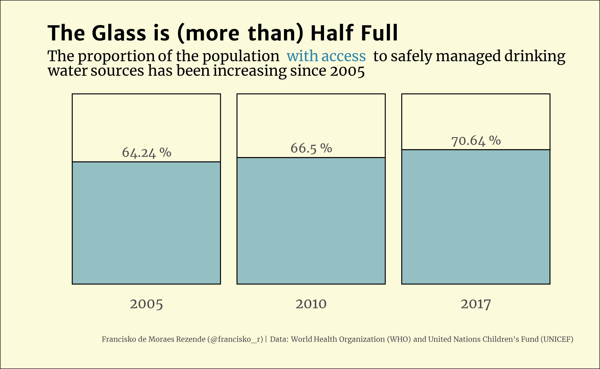

# #30DayChartChallenge

More info [here](https://github.com/Z3tt/30DayChartChallenge_Collection2021).

## Day 5: Slope:

+ [Code](https://github.com/francisko-rezende/30DayChartChallenge2021/blob/main/scripts/05-slope.R)

## Day 4: Magical:

+ [Code](https://github.com/francisko-rezende/30DayChartChallenge2021/blob/main/scripts/04-magical.R)

## Day 3: Historical:

+ [Code](https://github.com/francisko-rezende/30DayChartChallenge2021/blob/main/scripts/03-historical.R)

## Day 2: Pictogram:

+ [Code](https://github.com/francisko-rezende/30DayChartChallenge2021/blob/main/scripts/02-pictogram.R)

## Day 1: Part-to-whole:

+ [Code](https://github.com/francisko-rezende/30DayChartChallenge2021/blob/main/scripts/01-part-to-whole.R)

